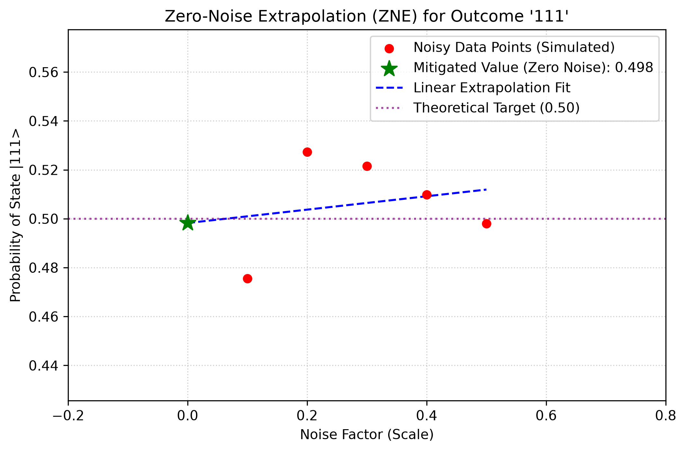

# Zero-Noise Extrapolation (ZNE) Error Mitigation Pipeline

A production-ready Python framework implementing **Zero-Noise Extrapolation (ZNE)** to mitigate quantum gate errors. This project scales a noisy **3-qubit Greenberger-Horne-Zeilinger (GHZ)** state quantum circuit inside Qiskit, applies classical linear regression to track the error scaling, and extrapolates back to the theoretical zero-noise limit.

## Scientific Core & Methodology

Quantum computers are inherently noisy due to environmental interaction and imperfect gate executions. Zero-Noise Extrapolation (ZNE) is a powerful, hardware-agnostic error mitigation technique that does not require additional quantum resources or physical error-correcting codes.

### 1. Noise Scaling

To find out how a quantum state degrades under noise, we deliberately amplify the error rates using a controlled **Noise Factor ($r$)**.

* $r = 1$: Base simulated hardware error probability ($p = 0.1$).
* $r = 3, 5$: Scaled error configurations where the noise is structurally multiplied.

### 2. Quantum Circuit Architecture

The framework builds a scalable 3-qubit GHZ state circuit. The GHZ state is a maximally entangled state, mathematically represented as:

$$\lvert \text{GHZ} \rangle = \frac{\lvert 000 \rangle + \lvert 111 \rangle}{\sqrt{2}}$$

Because of this max entanglement, it is exceptionally sensitive to phase and bit-flip errors, making it the perfect benchmark for testing error mitigation pipelines. The measurement mapping is kept strict at a 1:1 ratio between qubits and classical bits to guarantee uncorrupted data streams.

### 3. Classical Extrapolation

By executing the circuit at different noise levels, we gather noisy target state outcome probabilities. We then train a classical **Linear Regression** model on these data points and track the trend line backwards to find the $y$-intercept where the Noise Factor is exactly zero ($r = 0$).

---

## 📈 Extrapolation Analysis Visualized

The pipeline automatically handles adaptive axis windowing and padding to render high-resolution, inline-ready visualizations. Below is the behavioral response curve of the mitigation pipeline:



### Key Observations from the Plot:

* **Noisy Data Points (Red):** Show the linear degradation of the $\lvert 111 \rangle$ state probability as the noise factor scales upward.
* **Linear Extrapolation Fit (Blue):** The trendline tracking the error propagation.
* **Mitigated Value (Green Star):** The calculated intercept at zero-noise ($r=0$), effectively bypassing the hardware error floor.
* **Theoretical Target (Purple Line):** The mathematical perfect limit ($0.5000$). The mitigated value successfully pushes past the noisy execution limits to approach this target.

---

## 📁 Repository Structure

```text
├── src/
│   ├── __init__.py
│   ├── circuit_builder.py    # Scalable 3-qubit GHZ circuit construction
│   ├── mitigator.py          # ZNE error scaling, regression, and extrapolation
│   └── plotter.py            # Adaptive, publication-quality inline plotting
├── plots/
│   └── zne_mitigation_plot.png # Dynamically generated analysis graph
├── README.ipynb              # Fully documented, executable demonstration workbook
├── README.md                 # Static documentation profile for portfolio review
├── requirements.txt          # Python ecosystem dependencies (Qiskit, Scikit-learn, etc.)
└── .gitignore                # Production-grade environment shielding
